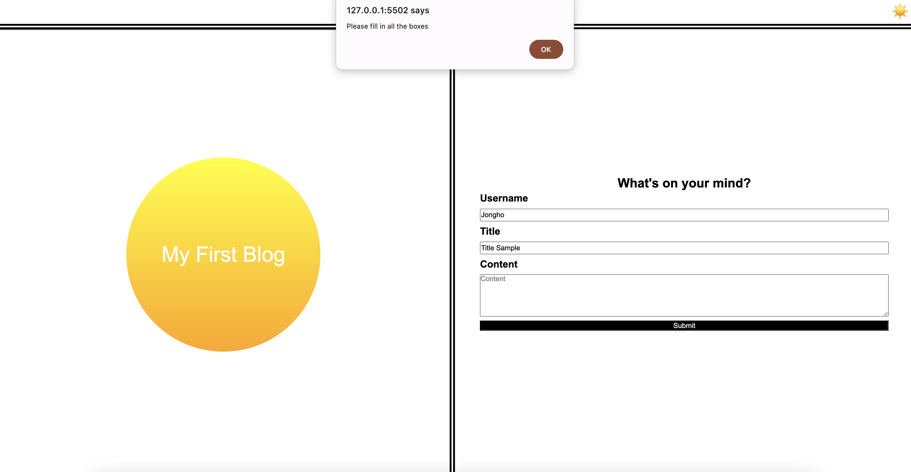

### Jongho Bae Portfolio

## Link to application
https://jonghobae0218.github.io/Blog_Jongho_Bae/

## Description
This is a blog
It provides 
1. Form to submit ideas
2. List of ideas so far submitted on the next page.

3. Navigation to previous page from Posts page.
4. Light and dark mode.

## Feature

1. Navigation. when clicking submit or back, it moves to the other html file.

2. Refines input. When any of the box is missing, webpage will give alert and data will not be saved.

3. Shows array on console. When inspecting console on Posts page, it shows the array of datas saved in local storage.

4. External link. When clicking portfolio button on Posts page, it links to protfolio

